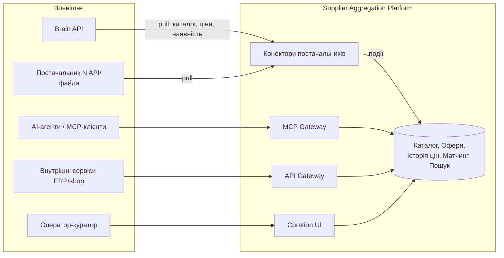
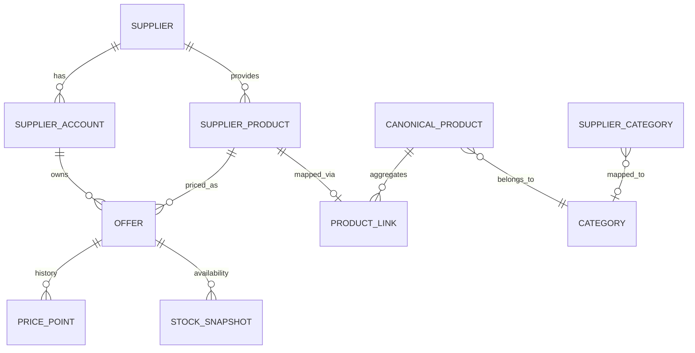
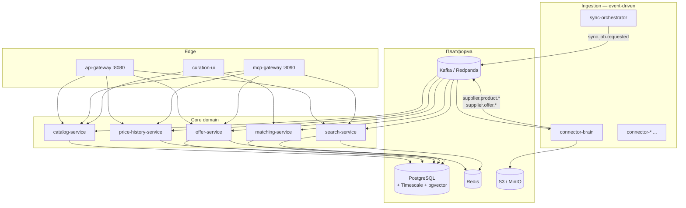

# Supplier Aggregation Platform — Архітектура

> Enterprise-агрегатор товарів багатьох постачальників: канонічний каталог, мультиакаунтні ціни та наявність,
> історія цін, кероване оператором зіставлення товарів (EAN/UPC/RAG), повна готовність до використання AI-агентами.

**Статус:** затверджена базова архітектура v1.0 (2026-07-11)
**Мова документації:** українська. Мова коду, комітів, ідентифікаторів, коментарів: англійська.

> Цей документ описує **цільову** архітектуру. Що з неї вже реалізовано (з зеленим CI), а що
> свідомо відкладено — див. **[Стан реалізації](#стан-реалізації-2026-07-13)** нижче.

---

## Стан реалізації (2026-07-13)

Наскрізний конвеєр працює й покритий тестами: **sync-orchestrator** за розкладом просить синк →
**connector-brain** тягне Brain і публікує події → **catalog / offer / price-history / matching / search**
споживають → **api-gateway / mcp-gateway** віддають назовні. `make up` піднімає всю систему.

> Другу хвилю доставлено серією PR #29–#43 (див. ADR-0006…0010): надійність (S3, Vault, DLQ),
> pricing/effective-price, дельта-синк, `search-service` (лексичний + семантичний), Timescale
> continuous aggregates, а також **`curation-ui`** (backoffice матчингу) з операціями курації
> confirm/reject/create-new/merge (PR #39–#40, план — [docs/curation-ui-plan.md](docs/curation-ui-plan.md)).

**Реалізовано (9 сервісів, 6 libs, зелений CI):**

| Область | Що зроблено |
|---|---|
| Фундамент | Монорепо (uv workspace), CI (ruff/mypy/import-linter/conventions/event-schemas/spectral/`compose config`), libs `core · contracts · connector-sdk · observability · persistence · messaging`, `scaffold`, стандарти + ADR-0001…0010 |
| Надійність | Transactional outbox + relay у продюсерів, ідемпотентні консюмери, **DLQ + обмежені ретраї + `tools/replay_dlq.py`** ([ADR-0006](docs/adr/0006-dead-letter-queue.md)), **Vault**-резолвер кредів + **S3/MinIO** raw-архів, **Alembic-міграції** (expand-migrate-contract), наскрізний **E2E-тест** |
| Ingestion | `sync-orchestrator` (розклад per-account, режим full/delta → `sync.job.requested`); `connector-brain` (сесії/SID, rate-limit 3 rps, нормалізація, S3 raw-archive; **повний і дельта-синк** через `modified_products` + watermark, [ADR-0008](docs/adr/0008-delta-sync-watermark.md); outbox relay) |
| Core | `catalog` (SupplierProduct + canonical link); `offer` (мультиакаунтні офери + **Pricing Engine / `effective_price`** + подія `offer.effective-price.changed`, [ADR-0007](docs/adr/0007-pricing-engine.md)); `price-history` (Timescale time-series + stats + **денний rollup / continuous aggregate + compression**, [ADR-0010](docs/adr/0010-portable-query-native-scale.md)); `matching` (GTIN auto-link + pgvector RAG + черга курації); **`search`** (лексичний + семантичний + **гібридний RRF + cross-encoder rerank**, [ADR-0009](docs/adr/0009-search-service.md) · [ADR-0011](docs/adr/0011-hybrid-search-rerank.md)) |
| Edge | `api-gateway` (bearer + скоупи + rate-limit + агрегований OpenAPI + CORS), `mcp-gateway` (MCP-інструменти: пошук/офери/best/product+offer/canonical/price-history/stats) |
| Backoffice | **`curation-ui`** (React 19 + TS, `apps/curation-ui`): черга курації, робоче місце ревʼю (diff атрибутів, офери, історія цін), рішення **confirm / reject / create-new / merge**, канонічний каталог; ходить через api-gateway (bearer + скоупи `matching:curate`) |
| Інфра | `make up` = Postgres(+Timescale+pgvector) · Redpanda · Redis · MinIO · OTel/Grafana **+ усі сервіси + curation-ui** (API/консюмери/relay, БД-на-сервіс, міграції на старті) |

**Відкладено / поза поточним обсягом (свідомо):**

- **OIDC для операторів + `curation-ui` v2 (решта)**: зараз статичний bearer. **Доставлено:** журнал
  рішень (append-only аудит-лог matching + сторінка), **дашборд оператора** (+ `GET /v1/curation/stats`),
  **моніторинг синхронізації** (`GET /v1/sync/accounts` + ручний тригер `POST …/trigger` у
  sync-orchestrator + сторінка). **Лишаються:** OIDC-автентифікація операторів, категорійний мапінг
  (окремий greenfield-епік: таксономія категорій + мапінг supplier→canonical), історія прогонів синків
  (job-run таблиця) (див. [docs/curation-ui-plan.md](docs/curation-ui-plan.md) §v2).
- **Хостинг ембедера та бекфіл**: реальний ембедер **BAAI/bge-m3 через TEI** підключено за протоколом
  `Embedder` (адаптер `TeiEmbedder` у `matching` і `search`, вмикається `*_EMBEDDER_URL`; офлайн-дефолт —
  детермінований hashing-ембедер, тож CI/тести не потребують GPU). Відкладено: продакшн-хостинг TEI-сервера
  та інструмент бекфілу (переembedding наявних рядків після зміни ширини вектора 256→1024 — наразі через
  реплей `supplier.product.discovered`).
- **Другий конектор** — валідація абстракцій connector-sdk на новому постачальнику.
- **Розширення пошуку** (доставлено): гібридний **RRF + cross-encoder rerank + splade-sparse**
  (3 ретрівери, [ADR-0011](docs/adr/0011-hybrid-search-rerank.md)), **PostgreSQL FTS
  (`tsvector`)-ранжування** лексики, та **індексація канонічних** товарів з `catalog.product.updated`
  (окремий `canonical_document` + ендпоінт `/v1/search/canonical`, що повертає canonical ids).
- **Пошук/price-history через gateway** (доставлено 2026-07-14): api-gateway проксіює
  `POST /v1/search/hybrid` і `POST /v1/search/canonical` (новий scope `search:read`) та
  `GET /v1/offers/{id}/price-history/daily`; mcp-gateway отримав інструменти `find_products`,
  `find_canonical_products`, `get_price_daily` і агрегат `best_price_for_query` (запит → канонічний
  топ-збіг → найдешевший офер). Канонічні reads через gateway тепер обслуговує **catalog**
  (власник картки, [ADR-0012](docs/adr/0012-catalog-owns-canonical.md)); merge лишився на matching.

---

## 1. Мета та скоуп

### 1.1 Що будуємо

Платформа, яка:

1. **Інтегрує багатьох постачальників** (перший — Brain, `brain_api_documentation.md`), у кожного постачальника може бути
   **кілька облікових записів** з різними фінансовими умовами (валюта, знижки, умови оплати) та різними термінами постачання.
2. **Зіставляє товари** різних постачальників у **канонічний товар** платформи:
   - детерміновано за EAN / UPC / GTIN;
   - кандидати через RAG (векторна схожість назв + характеристик);
   - фінальне рішення — **завжди курується оператором** (крім точних GTIN-збігів).
3. **Відстежує та зберігає ціни**: повна історія цін по кожному оферу (обліковий запис × товар постачальника),
   агрегати (min/avg/max по днях), події зміни ціни.
4. **AI Tools ready**: кожен сервіс — з машиночитним контрактом (OpenAPI 3.1 + тул-маніфест), а назовні —
   єдиний MCP-шлюз з інструментами для агентів (пошук, ціни, наявність, історія, RAG-запити).

### 1.2 Споживачі

| Споживач | Спосіб доступу |
|---|---|
| Внутрішні сервіси компанії (ERP, e-commerce, прайсинг) | REST API через API Gateway |
| AI-агенти (Claude та інші) | MCP Gateway (streamable HTTP) + ті самі REST API |
| Оператори-куратори матчингу | Curation UI (backoffice) |
| Аналітика / BI | read-replica PostgreSQL + експорти |

### 1.3 Поза скоупом v1

- Замовлення/резервування у постачальників (Brain: order, reserve, ship) — тільки читання каталогу/цін/наявності.
- Бухгалтерські та сервісні методи постачальників.
- Публічний B2C-фронт.

---

## 2. Ключові архітектурні рішення

| # | Рішення | Вибір | ADR |
|---|---|---|---|
| 1 | Репозиторій | **Монорепо** (uv workspace) | [ADR-0001](docs/adr/0001-monorepo-python-uv.md) |
| 2 | Мова/стек | **Python 3.12**, FastAPI, Pydantic v2, SQLAlchemy 2 | [ADR-0001](docs/adr/0001-monorepo-python-uv.md) |
| 3 | Стиль взаємодії | **Гібрид**: event-driven для ingestion/синхронізації, синхронний REST для запитів читання | [ADR-0002](docs/adr/0002-event-driven-kafka.md) |
| 4 | Брокер подій | **Kafka API** (dev/початок — Redpanda; сумісно з Kafka у проді) | [ADR-0002](docs/adr/0002-event-driven-kafka.md) |
| 5 | Сховища | **PostgreSQL 16** (+TimescaleDB для історії цін, +pgvector для ембедингів), Redis (кеш), S3/MinIO (сирі payload'и, зображення) | [ADR-0003](docs/adr/0003-storage.md) |
| 6 | Матчинг | GTIN-детермінований auto-link + RAG-кандидати + **обов'язкова людська курація** | [ADR-0004](docs/adr/0004-matching-pipeline.md) |
| 7 | AI-готовність | OpenAPI 3.1 з описами під LLM + `tool_manifest.json` на кожен сервіс + єдиний **MCP Gateway** | [ADR-0005](docs/adr/0005-ai-tools-ready.md) |
| 8 | Мікросервіси | 9 сервісів + 6 бібліотек; **1 сервіс = 1 БД-схема**, спільної БД між сервісами немає | цей документ |
| 9 | Надійність подій | **DLQ + обмежені ретраї** + `tools/replay_dlq.py`; консюмери ідемпотентні | [ADR-0006](docs/adr/0006-dead-letter-queue.md) |
| 10 | Ціноутворення | **Pricing Engine**: `effective_price` = база × умови акаунта → подія `offer.effective-price.changed` | [ADR-0007](docs/adr/0007-pricing-engine.md) |
| 11 | Дельта-синк | `modified_products` + **watermark** per account (замість повного скану щоразу) | [ADR-0008](docs/adr/0008-delta-sync-watermark.md) |
| 12 | Пошук | `search-service`: лексика (FTS `tsvector`) + семантика (pgvector) як окремі режими | [ADR-0009](docs/adr/0009-search-service.md) |
| 13 | Історія цін | Портативний SQL + **Timescale** (continuous aggregate + compression) під масштаб | [ADR-0010](docs/adr/0010-portable-query-native-scale.md) |
| 14 | Гібридний пошук | **RRF-злиття** лексики/семантики/splade + **cross-encoder rerank** (TEI, офлайн-дефолт) | [ADR-0011](docs/adr/0011-hybrid-search-rerank.md) |
| 15 | Власність канонічної картки | **catalog** складає картку (`build_canonical_card` → `catalog.product.updated`); matching лише вирішує членство | [ADR-0012](docs/adr/0012-catalog-owns-canonical.md) |

**Чому монорепо + мікросервіси + події (а не щось одне):**

- *Монорепо* — єдині стандарти, спільні бібліотеки (contracts, connector-sdk, observability), атомарні зміни контрактів,
  один CI. Для команди < 20 інженерів альтернатива (полірепо) дає лише накладні витрати.
- *Мікросервіси* — конектори постачальників мають різні цикли деплою і різні ризики (зовнішні API падають, ліміти),
  матчинг має ML-залежності, історія цін має інший профіль навантаження (append-heavy). Розділення по цих швах природне.
- *Event-driven для ingestion* — синхронізація з постачальниками асинхронна за природою (rate limits, ретраї, великі
  обсяги), а події `price-changed`/`stock-changed` — природне джерело для історії цін і кеш-інвалідації.
  Читання (запити агентів/сервісів) — синхронний REST: простіше, передбачувана латентність.

---

## 3. Контекст системи (C4 L1)



---

## 4. Доменна модель

### 4.1 Основні сутності



| Сутність | Опис | Ключові поля |
|---|---|---|
| **Supplier** | Постачальник як організація | `id (ULID)`, `code` ("brain"), connector type, rate limits |
| **SupplierAccount** | Обліковий запис у постачальника. Свої credentials, **фінансові умови** (валюта розрахунку, % знижки, кредитний ліміт, умови оплати) і **умови постачання** (доступні склади/targets, SLA доставки) | `id`, `supplier_id`, `credentials_ref` (Vault), `financial_terms JSONB`, `delivery_terms JSONB`, `priority` |
| **SupplierProduct** | Товар у термінах постачальника, як він є (RAW нормалізований) | `id`, `supplier_id`, `external_id` (Brain: productID), `external_code` (product_code), `articul` (MPN), `ean`, `upc`, `name`, `brand`, `attributes JSONB`, `supplier_category_id`, `content_hash` |
| **CanonicalProduct** | Канонічний товар платформи — результат матчингу | `id (ULID)`, `gtin[]`, `mpn`, `brand`, `title`, `attributes JSONB` (з field-level provenance), `category_id`, `status` |
| **ProductLink** | Зв'язок SupplierProduct → CanonicalProduct | `supplier_product_id`, `canonical_product_id`, `method` (`gtin_auto` / `rag_suggested` / `manual`), `confidence`, `status` (`auto` / `pending_review` / `confirmed` / `rejected`), `decided_by`, `decided_at` |
| **Offer** | Комерційна пропозиція: конкретний товар постачальника **в розрізі конкретного облікового запису** | `id`, `supplier_account_id`, `supplier_product_id`, `price`, `currency`, `price_uah`, `rrp`, `effective_price` (з урахуванням умов акаунта), `stocks JSONB`, `delivery_estimate`, `updated_at` |
| **PricePoint** | Точка історії ціни (Timescale hypertable) | `offer_id`, `ts`, `price`, `currency`, `price_uah`, `effective_price`, `rrp`, `source_sync_id` |
| **StockSnapshot** | Історія наявності (опційно проріджена) | `offer_id`, `ts`, `stock_id`, `qty/available` |
| **Category / SupplierCategory** | Внутрішнє дерево категорій + мапінг категорій постачальника | `id`, `parent_id`, `path (ltree)` |

**Ключові інваріанти:**

1. `SupplierProduct` унікальний по `(supplier_id, external_id)`.
2. Один `SupplierProduct` лінкується максимум до одного `CanonicalProduct` (`status != rejected`).
3. `Offer` унікальний по `(supplier_account_id, supplier_product_id)` — **саме тут живе мультиакаунтність**:
   один товар Brain може мати 3 офери від 3 акаунтів з різними цінами й термінами.
4. `PricePoint` пишеться **тільки** при фактичній зміні ціни (порівняння з попереднім значенням), плюс
   добовий heartbeat-снепшот для цілісності графіків.
5. Усі ID — ULID (сортовані за часом, безпечні для розподілених систем).
6. Гроші — `NUMERIC(14,4)` + ISO-4217 код валюти. Ніколи float.

### 4.2 Identifiers: нормалізація GTIN

- EAN-13, UPC-A, EAN-8 нормалізуються до **GTIN-14** (leading zeros) у `libs/core/gtin.py`.
- Перевірка check digit обов'язкова; невалідні значення зберігаються в `raw_identifiers`, але не беруть участь в auto-matching.
- Один канонічний товар може мати кілька GTIN (мультипаки, регіональні варіанти) — масив із приміткою.

---

## 5. Сервіси (C4 L2)



### 5.1 `connector-brain` (та шаблон `connector-*`)

Ізолює всю специфіку постачальника. Реалізує інтерфейс `SupplierConnector` з `libs/connector-sdk`:

```python
class SupplierConnector(Protocol):
    async def healthcheck(self) -> ConnectorHealth
    async def fetch_categories(self) -> AsyncIterator[RawCategory]
    async def fetch_products(self, category: str, cursor: Cursor | None) -> Page[RawProduct]
    async def fetch_product(self, ref: ProductRef) -> RawProduct          # by id / articul / code
    async def fetch_deltas(self, since: datetime) -> AsyncIterator[DeltaRef]   # Brain: modified_products
    async def fetch_offers(self, account: AccountCtx) -> AsyncIterator[RawOffer]  # ціни+наявність по акаунту
    async def fetch_stocks_meta(self, account: AccountCtx) -> list[RawStock]
```

Специфіка Brain усередині конектора:

- **Сесії**: `POST /auth` (login + MD5 password) → SID; кеш SID у Redis з TTL, авто-relogin при помилці сесії.
  Окрема сесія на кожен `SupplierAccount`.
- **Rate limit**: token bucket **3 req/s на акаунт** (документований ліміт Brain), глобальний семафор на конектор;
  на `429`/код 115 — exponential backoff + jitter.
- **Повний прохід**: `categories` → `products/{categoryID}` (limit/offset пагінація) → нормалізація → події.
- **Дельта**: `modified_products?modified_time=...` кожні N хвилин (типи: descriptions/options/images/new) →
  точкові `product/{id}` дозапити.
- **Ціни/наявність**: поля `price`, `price_uah`, `retail_price_uah`, `stocks`, `stocks_expected`, `available`
  з products/pricelists; `stocks`, `targets`, `delivery_time` для довідників складів і SLA доставки.
- Сирий payload кожної відповіді → S3 (`raw/{supplier}/{date}/{request_id}.json.gz`) для реплею та дебагу.
- Нормалізація в **канонічні DTO** (`libs/contracts`), диф по `content_hash` — події тільки на реальні зміни.

**Продукує події:** `supplier.product.discovered|updated|archived`, `supplier.offer.price-changed`,
`supplier.offer.stock-changed`, `supplier.category.synced`, `sync.job.completed|failed`.

### 5.2 `sync-orchestrator`

- Розклади синхронізацій per supplier/account: повна (ніч), дельта (кожні 10–15 хв), ціни (частіше, якщо є дешевий шлях — прайслисти).
- Патерн: publishes `sync.job.requested`, конектор виконує, звітує `sync.job.completed` з метриками (items, changed, errors).
- Ідемпотентність джобів (`sync_job_id`), захист від накладання (не запускати нову повну, поки йде попередня), 
  ескалація в алерт при N поспіль фейлів.
- **Read/trigger API** (для curation-ui моніторингу): `GET /v1/sync/accounts` — стан кожного акаунта
  (supplier, kind, mode, interval, `last_requested_at`, `next_due_at`, статус `never|ok|overdue`; **без**
  `credentials_ref` та фінансових умов — hard-rule 6), `POST /v1/sync/accounts/{id}/trigger` — ручний
  синк «зараз» (емітить `sync.job.requested` через outbox). Окремий процес від планувальника й relay.

### 5.3 `catalog-service`

- Власник `SupplierProduct`, канонічної **картки** товару (`CanonicalProduct`), `Category`, мапінгу категорій.
- Консюмить `supplier.product.*` → upsert SupplierProduct → тригерить matching.
- **Власник канонічної картки** ([ADR-0012](docs/adr/0012-catalog-owns-canonical.md)): консюмить
  `matching.link.confirmed` → прив'язує товар постачальника до канонічного (`set_canonical_link`) →
  детерміновано **перебудовує картку** чистою функцією `build_canonical_card` (члени за `supplier_product_id`,
  найменший id — представник title; brand/gtin — перший член, що має; атрибути мерджаться, нижчий id виграє).
  На merge/split перебудовує і `previous_canonical_product_id`.
- REST: `GET /products/{id}`, `GET /products?gtin=&mpn=&supplier=&category=`, `GET /categories/tree`,
  `GET /suppliers/{id}/products/{external_id}`.
- Продукує `catalog.product.updated` — **єдине джерело істини** канонічної картки для `search` (індексація)
  і `offer` (інвалідація кешу).

### 5.4 `matching-service`

Пайплайн зіставлення (деталі — ADR-0004):

1. **Deterministic pass** — нормалізований GTIN збігся з існуючим CanonicalProduct → `ProductLink(method=gtin_auto,
   status=auto, confidence=1.0)`. Колізії GTIN (один GTIN у різних канонічних) → у чергу оператора.
2. **Candidate generation (RAG)** — ембединг (назва + бренд + ключові атрибути, нормалізовані через підходи
   з getAttrService) → top-k по pgvector серед канонічних товарів тієї ж/сусідньої категорії →
   re-rank: brand equality, MPN fuzzy, порівняння атрибутів → `confidence`.
3. **Черга курації** — кандидати з `confidence >= threshold_low` потрапляють у `pending_review`;
   нижче — новий CanonicalProduct створюється як `draft` (теж на підтвердження).
4. **Рішення оператора** — confirm / reject / merge / split / create-new. Кожне рішення — подія
   `matching.link.confirmed|rejected` + запис у **журнал рішень** (append-only аудит-лог: хто, коли,
   яка дія, до/після). matching лише **вирішує членство** й емітить `matching.link.confirmed`; складання
   канонічної картки — за каталогом ([ADR-0012](docs/adr/0012-catalog-owns-canonical.md)).
5. **Feedback loop** — підтвердження/відхилення зберігаються як розмічені пари для тюнінгу порогів і моделей.

REST для Curation UI: черга з пріоритезацією (нові товари з оферами → вище), side-by-side порівняння характеристик,
журнал рішень (`GET /v1/curation/decisions`) і зведена статистика оператора (`GET /v1/curation/stats`).
Канонічні reads (`GET /v1/canonical-products`) наразі обслуговує matching (перенесення на catalog — відкладено).

### 5.5 `offer-service`

- Власник `SupplierAccount` (без секретів — вони у Vault), `Offer`, поточної наявності.
- Консюмить `supplier.offer.*` → upsert Offer → рахує **effective_price** через Pricing Engine:
  базова ціна постачальника × фінансові умови акаунта (знижка, курс, націнки правилами) → якщо змінилась —
  подія `offer.effective-price-changed`.
- REST: `GET /offers?canonical_product_id=` (усі офери канонічного товару по всіх постачальниках/акаунтах,
  відсортовані за effective_price), `GET /offers/best?canonical_product_id=&qty=&max_delivery_days=`,
  `GET /accounts`, `GET /stocks`.
- Redis-кеш гарячих вибірок, інвалідація по подіях.

### 5.6 `price-history-service`

- Консюмить `supplier.offer.price-changed` + `offer.effective-price-changed` → append у Timescale hypertable.
- Continuous aggregates: `price_daily (min/max/avg/last)` per offer і per canonical product.
- Compression policy (>90 днів), retention політика сирих точок конфігурована.
- REST: `GET /price-history?offer_id=&from=&to=&granularity=raw|day|week`,
  `GET /price-history/by-product/{canonical_id}` (зведена по всіх оферах), `GET /price-history/stats` (min-ever, trend).

### 5.7 `search-service`

Єдина точка пошуку для людей і агентів:

- **Лексичний**: PostgreSQL FTS (`tsvector`-ранжування) по назві, артикулу, кодах — точні запити
  "по артикулу / по коду товару".
- **Векторний (RAG)**: pgvector (bge-m3 через TEI, офлайн-дефолт — hashing-ембедер) по ембедингах
  канонічних товарів і товарів постачальників — «непрямі абстрактні запити» ("материнка під Ryzen 9000").
- **Learned-sparse (SPLADE)**: `sparsevec` (splade через TEI) — третій ретрівер, опційний
  (`SEARCH_SPARSE_EMBEDDER_URL`); не налаштовано — просто вимкнено.
- **Гібрид** ([ADR-0011](docs/adr/0011-hybrid-search-rerank.md)): `POST /v1/search/hybrid` — конвеєр
  retrieve → **RRF-злиття** (лексика + семантика + splade, `k=60`, без нормалізації) → **cross-encoder
  rerank** (bge-reranker через TEI, дефолт `NoopReranker` тримає RRF-порядок без GPU) + фільтри.
- Індексація по подіях `catalog.product.updated` — окремий `canonical_document` + ендпоінт
  `/v1/search/canonical` (повертає canonical ids); embedding-воркер — консюмер з батчингом.
- REST: `POST /search` (structured query DSL), `POST /search/semantic` (natural language),
  `POST /v1/search/hybrid`, `GET /search/by-code/{code}`, `GET /search/by-articul/{articul}`.

### 5.8 `api-gateway`

- Єдина точка входу для сервісів компанії: маршрутизація, **аутентифікація** (bearer-токен за SHA-256-хешем →
  принципал зі скоупами; OIDC для людей — відкладено), авторизація по скоупах (`catalog:read`, `offers:read`,
  `prices:read`, `matching:curate`, `sync:read`), rate limiting per principal, агрегований OpenAPI, `/v1/*`.
- Проксує зокрема `GET /v1/curation/stats` (дашборд), `GET /v1/sync/accounts` + `POST /v1/sync/accounts/{id}/trigger`
  (моніторинг синків) на відповідні сервіси.
- Тонкий: без бізнес-логіки, тільки крос-каттинг.

### 5.9 `mcp-gateway`

MCP-сервер (streamable HTTP) поверх внутрішніх REST API. Інструменти v1:

| Tool | Опис для агента |
|---|---|
| `search_products` | Гібридний пошук по каталогу: текст/артикул/код/GTIN, фільтри категорії, бренду, наявності, ціни |
| `semantic_search` | Пошук за абстрактним описом потреби природною мовою |
| `get_product` | Повна канонічна картка: атрибути, всі лінковані товари постачальників |
| `get_offers` | Актуальні ціни й наявність по всіх постачальниках/акаунтах для товару; параметри qty, max_delivery_days |
| `get_price_history` | Історія ціни товару/оферу з агрегатами і трендом |
| `list_categories` / `browse_category` | Дерево категорій, каталог постачальника в розрізі категорій |
| `get_supplier_info` | Довідник постачальників, акаунтів (без фінансових деталей — за скоупом), складів, SLA доставки |

Правила якості інструментів — у [docs/standards/api-guidelines.md](docs/standards/api-guidelines.md) (розділ AI-Ready).
MCP Gateway транслює скоупи: агент отримує токен з тими ж permission'ами, що й будь-який API-клієнт.

### 5.10 `curation-ui`

Backoffice (React + TypeScript, Vite) для операторів: черга матчингу, порівняння карток, менеджмент категорійного
мапінгу, моніторинг синхронізацій. Ходить через api-gateway (OIDC).

### 5.11 Бібліотеки (`libs/`)

| Бібліотека | Вміст |
|---|---|
| `libs/contracts` | Pydantic DTO усіх подій і публічних API-моделей, JSON Schema експорт (source of truth — `contracts/events/*.json`) |
| `libs/connector-sdk` | `SupplierConnector` protocol, rate limiter, session manager, S3 raw writer, нормалізатори (GTIN, units), тест-кит конектора |
| `libs/core` | ULID, money, ідентифікатори, помилки (problem+json), пагінація, спільні утиліти |
| `libs/observability` | OTel bootstrap (traces/metrics/logs), structlog конфіг, FastAPI/FastStream middleware, health/readiness |

Правило залежностей: `services/* → libs/*`; `libs/* ↛ services/*`; сервіс ніколи не імпортує інший сервіс.
Перевіряється `tools/check_conventions.py` + import-linter.

---

## 6. Події та контракти

### 6.1 Конвенції

- Формат: **CloudEvents 1.0** (JSON), envelope у `contracts/events/_envelope.json`.
- Іменування типу: `<domain>.<entity>.<past-tense-action>` — напр. `supplier.offer.price-changed`.
- Топіки Kafka: `sa.<domain>.<entity>` (напр. `sa.supplier.offer`), key = agregate id (гарантія порядку по оферу).
- Версія схеми — у `dataschema` + поле `schema_version`; зміни **тільки backward-compatible** у межах major.
- Всі схеми лежать у `contracts/events/*.json`, валідуються в CI (`tools/check_event_schemas.py`);
  продюсери/консюмери використовують згенеровані Pydantic-моделі з `libs/contracts`.

### 6.2 Реєстр подій v1

| Тип події | Продюсер | Консюмери |
|---|---|---|
| `sync.job.requested / completed / failed` | orchestrator / конектори | orchestrator, телеметрія |
| `supplier.product.discovered / updated / archived` | конектори | catalog |
| `supplier.offer.price-changed` | конектори | offer, price-history |
| `supplier.offer.stock-changed` | конектори | offer |
| `catalog.product.updated` | catalog | search, offer (кеш) |
| `matching.candidate.requested` | catalog | matching |
| `matching.link.suggested` | matching | (UI через API) |
| `matching.link.confirmed / rejected` | matching | catalog, search |
| `offer.effective-price-changed` | offer | price-history |

### 6.3 Надійність

- **Transactional outbox** у кожному продюсері (таблиця `outbox` + relay) — жодних dual-write.
- Консюмери **ідемпотентні** (dedupe по `event id` у `processed_events`, upsert-семантика).
- Ретраї: 3 спроби з backoff → **DLQ** `sa.dlq.<topic>`; DLQ-моніторинг з алертом, тула реплею.
- Порядок гарантується тільки в межах partition key (aggregate id) — консюмери не покладаються на глобальний порядок.

---

## 7. Ключові потоки

### 7.1 Дельта-синхронізація Brain (кожні 10–15 хв)

```mermaid
sequenceDiagram
    participant O as sync-orchestrator
    participant C as connector-brain
    participant B as Brain API
    participant K as Kafka
    participant CAT as catalog
    participant OFF as offer
    participant PH as price-history

    O->>K: sync.job.requested (delta, account=A1)
    K->>C: consume
    C->>B: modified_products?modified_time=last_success
    B-->>C: [productIDs]
    loop батчами, ≤3 rps
        C->>B: product/{id} (SID акаунта A1)
        C->>C: normalize → diff by content_hash
    end
    C->>K: supplier.product.updated / supplier.offer.price-changed
    K->>CAT: upsert SupplierProduct → matching.candidate.requested (якщо новий)
    K->>OFF: upsert Offer → effective price recalc
    K->>PH: append PricePoint
    C->>K: sync.job.completed (stats)
```

### 7.2 Матчинг нового товару

```
supplier.product.discovered
  → matching: GTIN нормалізація
     ├─ точний GTIN-збіг, без колізій → ProductLink(auto) → catalog.product.updated
     ├─ RAG top-k, confidence ≥ 0.65 → pending_review → черга оператора
     └─ немає кандидатів → draft CanonicalProduct → черга оператора (підтвердити створення)
Оператор у Curation UI: confirm | reject | merge | create-new
  → matching.link.confirmed → catalog перебудовує канонічну картку → search переіндексовує
```

### 7.3 Запит AI-агента «знайди найдешевшу плату під Ryzen 9000 з доставкою до 2 днів»

```
Агент → mcp-gateway.semantic_search(query) → search-service (hybrid) → canonical ids
Агент → mcp-gateway.get_offers(product_id, max_delivery_days=2)
      → offer-service: офери всіх акаунтів, effective_price, delivery_estimate по складах
Агент → mcp-gateway.get_price_history(product_id, granularity=day)  # чи ціна зараз хороша
```

Кожен tool-виклик має `trace_id`, який наскрізно проходить через усі сервіси (OTel).

---

## 8. Дані та схеми БД

Один PostgreSQL-кластер, **окрема schema на сервіс** (`catalog`, `offers`, `price_history`, `matching`, `search`),
міграції — Alembic per service, крос-схемних FK немає (тільки логічні посилання по ULID).

Ключові технічні рішення:

- `price_history.price_points` — Timescale hypertable, chunk = 7 днів, compression після 90 днів,
  continuous aggregate `price_daily`.
- `search.embeddings` — pgvector `vector(1024)`, HNSW індекс; модель ембедингів конфігурована
  (multilingual, напр. `bge-m3` self-hosted або API), версія моделі зберігається поруч із вектором.
- `catalog.supplier_products.attributes`, `offers.offers.stocks` — JSONB + GIN-індекси за потребою.
- Категорії — `ltree` для швидких піддеревних вибірок.
- Read-replica для аналітики/BI; сервіси в неї не ходять.

Оцінка обсягів (планування): 5 постачальників × 200k товарів × 3 акаунти ≈ 3M оферів; при 2 змінах ціни/тиждень
≈ 300M price points/рік до компресії — Timescale з цим працює комфортно на одному вузлі.

---

## 9. AI Tools Ready — вимоги до кожного сервісу

Обов'язково для кожного сервісу (перевіряється `tools/check_conventions.py` у CI):

1. **OpenAPI 3.1** з повними описами: кожен endpoint/параметр/поле має `description`, написаний так,
   щоб LLM міг ним скористатись без людини (semantics, units, приклади, обмеження).
2. **`tool_manifest.json`** у корені сервісу — декларація операцій, придатних як AI-інструменти:
   name, when-to-use, args schema, cost class (cheap/expensive), safety (read-only/mutating).
3. **Детерміновані, ідемпотентні read-операції**, курсорна пагінація, стабільне сортування.
4. **Помилки — RFC 9457 `application/problem+json`** з машиночитним `type` і `detail`, achievable remediation.
5. **Ліміти дружні до агентів**: `429` з `Retry-After`; великі вибірки — пагінація, а не обрізання мовчки.
6. Відповіді **самодостатні**: enum-значення розшифровані, коди супроводжуються назвами
   (не `stockID: 121`, а `{"stock_id": 121, "name": "Київ, склад 1", "city": "Київ"}`).
7. `GET /healthz`, `GET /readyz`, `GET /.well-known/tool-manifest` — стандартні шляхи.

---

## 10. Нефункціональні вимоги

| Категорія | Вимога |
|---|---|
| **Латентність читання** | p95: пошук ≤ 400 мс, картка/офери ≤ 150 мс, історія ціни ≤ 300 мс |
| **Свіжість даних** | Ціни/наявність: ≤ 15 хв від зміни у постачальника (обмежено rate limit'ом) |
| **Доступність** | Read path 99.9%; ingestion може деградувати без впливу на читання (дані просто старіші) |
| **Масштабування** | Конектори — горизонтально per supplier/account; консюмери — по партиціях; читання — репліки + кеш |
| **Безпека** | Секрети постачальників тільки у Vault/SOPS, ніколи в БД/коді/логах; TLS всюди; скоупи на кожен API-виклик; аудит рішень операторів і mutating-викликів |
| **Відповідність** | Фінансові умови акаунтів — доступ за окремим скоупом `accounts:financial:read` |
| **Відновлюваність** | Реплей з S3 raw payload'ів; події з DLQ реплеяться тулою; повна пересинхронізація постачальника ≤ 8 год |
| **Телеметрія** | 100% сервісів з OTel traces+metrics+logs; SLO-дашборди; алерти на sync failures, DLQ, staleness (див. [telemetry.md](docs/standards/telemetry.md)) |

---

## 11. Структура монорепо

```
supplierAggregation/
├── CLAUDE.md                     # інструкції для AI-агентів розробки
├── ARCHITECTURE.md               # цей документ
├── pyproject.toml                # uv workspace root + ruff/mypy/pytest config
├── Makefile                      # єдині команди dev-циклу
├── contracts/
│   └── events/                   # JSON Schema подій (source of truth)
├── docs/
│   ├── adr/                      # Architecture Decision Records
│   └── standards/                # code-style, api, events, telemetry, infrastructure
├── libs/
│   ├── contracts/  ├── connector-sdk/  ├── core/  └── observability/
├── services/
│   ├── api-gateway/ ├── mcp-gateway/ ├── sync-orchestrator/
│   ├── connector-brain/ ├── catalog/ ├── matching/
│   ├── offer/ ├── price-history/ └── search/
├── apps/
│   └── curation-ui/
├── infra/
│   ├── compose.yaml              # повний dev-стек
│   ├── helm/                     # чарти для k8s (prod)
│   └── otel/ grafana/ ...        # конфіги телеметрії
├── tools/                        # тулзи консистентності (див. нижче)
└── .github/workflows/ci.yml
```

Кожен сервіс має однакову внутрішню структуру (генерується `tools/scaffold_service.py`):

```
services/<name>/
├── pyproject.toml        # залежності сервісу
├── Dockerfile
├── tool_manifest.json
├── src/<pkg>/
│   ├── main.py           # FastAPI/FastStream app factory
│   ├── api/              # роутери (тонкі)
│   ├── domain/           # бізнес-логіка, без I/O
│   ├── adapters/         # БД, Kafka, зовнішні API
│   ├── events/           # продюсери/консюмери
│   └── settings.py       # pydantic-settings
├── migrations/           # alembic
└── tests/                # unit + integration (testcontainers)
```

---

## 12. Фази впровадження

| Фаза | Обсяг | Вихід |
|---|---|---|
| **0. Фундамент** (1-2 тижні) | Монорепо, CI, compose-стек, libs (core, observability, contracts), scaffold, стандарти | `make up` піднімає порожню платформу з телеметрією |
| **1. Brain ingestion** | connector-brain (1 акаунт), sync-orchestrator, catalog (SupplierProduct), сирі дані в S3 | Каталог Brain синхронізується, дельти працюють |
| **2. Офери й історія** | offer-service (мультиакаунт, financial terms), price-history + Timescale, події цін | Ціни/наявність по акаунтах, історія пишеться |
| **3. Матчинг** | matching-service: GTIN auto + RAG кандидати, Curation UI MVP, канонічні товари | Оператор курує, канонічний каталог росте |
| **4. Пошук + AI** | search-service (hybrid), api-gateway (auth/scopes), mcp-gateway з tools | Агенти працюють з платформою через MCP |
| **5. Другий постачальник** | Новий конектор за connector-sdk — валідація абстракцій | Time-to-market нового постачальника ≤ 2 тижні |

---

## 13. Пов'язані документи

- [docs/standards/code-style.md](docs/standards/code-style.md) — вимоги до коду та код-стайл
- [docs/standards/api-guidelines.md](docs/standards/api-guidelines.md) — REST + AI-Ready гайдлайни
- [docs/standards/events.md](docs/standards/events.md) — події, схеми, надійність
- [docs/standards/telemetry.md](docs/standards/telemetry.md) — телеметрія, SLO, алерти
- [docs/standards/infrastructure.md](docs/standards/infrastructure.md) — інфраструктура, деплой, секрети
- [docs/adr/](docs/adr/) — рішення з обґрунтуванням
- [CLAUDE.md](CLAUDE.md) — правила для AI-агентів розробки
